<!-- i18n-key: README; locale: en; reviewed: 2026-08-15 -->
[English](README.md) · [繁體中文](README.zh-TW.md)

# Skill.md-native

[](https://github.com/ed3c/Skill.md-native/actions/workflows/unit.yml)
[](https://github.com/ed3c/Skill.md-native/actions/workflows/integration.yml)
[](LICENSE)
[](pyproject.toml)

**Runtime-verified identity, evidence, security, replay, compatibility, and outcome ranking for Agent Skills and `SKILL.md` workflows.**

> **Maturity:** alpha research and engineering platform. Deterministic local paths and the capabilities named in the integration ledger are implemented. A configured adapter, fixture, CI job, signature, or registry entry does not prove live sandbox, browser, Android device, model-provider, or production verification.

## The problem

A Skill can be discoverable, installable, and syntactically valid while still being unsafe, non-reproducible, incompatible with a target Agent, or impossible to rank fairly. Mutable repository references, hidden runtime differences, model changes, missing evidence, and self-authored success claims make comparisons unreliable.

Skill.md-native answers a stricter set of questions:

```text
What exact Skill artifact ran?
Which Agent, Runtime, Model, policy, permissions, and scenario were used?
What commands and inputs were actually executed?
What evidence was captured?
Did required assertions pass?
Did any non-compensable security gate fail?
Can the result be replayed?
Can a ranking claim be traced to immutable evidence?
```

## What the platform provides

| Layer | Responsibility |
|---|---|
| Immutable ingestion | Resolve mutable registry or Git references to pinned artifacts with provenance and supply-chain evidence |
| Harness compilation | Validate `RunSpec`, `HarnessManifest`, DomainAdapter, runtime capabilities, policy, budgets, stdin transport, and required evidence |
| Controlled execution | Run coding, browser, Android, or future domain contracts through bounded runtime adapters |
| Evidence and verdict | Normalize receipts and artifacts, verify identity continuity, execute assertions, and apply a non-compensable security gate |
| Run Artifacts | Derive Evidence Graphs, replay classification, logical traces, outcome scorecards, and a canonical bundle |
| Attestation | Sign canonical statements, verify key policy, and publish transparency inclusion receipts without upgrading a failed verdict |
| Compatibility and ranking | Compare explicit `Skill × Agent × Runtime × Model` cells without silently pooling confounders |

The verifier-owned layer is the product boundary. Registries, marketplaces, Agent frameworks, model providers, and sandboxes are inputs or execution dependencies.

## End-to-end trust flow

```mermaid
flowchart LR
    A[Registry / repository / plugin] --> B[Immutable provenance]
    B --> C[RunSpec + HarnessManifest]
    C --> D[Trusted DomainAdapter]
    D --> E[Digest-addressed HarnessPlan]
    E --> F[Controlled runtime / domain runner]
    F --> G[EvidenceBundle]
    G --> H[Deterministic verifiers]
    H --> I{Security gate}
    I -->|pass| J[HarnessVerdict]
    I -->|fail| X[Ineligible result]
    J --> K[RunArtifactBundle]
    K --> L[Optional DSSE + transparency]
    L --> M[Compatibility cells and ranking]
```



Core invariants:

```text
mutable discovery reference != evaluated identity
configured workflow != executed evidence
fixture success != live runtime success
signature != correctness
transparency inclusion != runtime verification
emulator verification != physical-device verification
task success cannot compensate for High/Critical security failure
```

## Quick start

### Requirements

- Python 3.11+
- Git
- Optional browser domain: Playwright Chromium
- Optional live runtimes: their own reviewed prerequisites and credentials

```bash
git clone https://github.com/ed3c/Skill.md-native.git
cd Skill.md-native

python -m venv .venv
source .venv/bin/activate
python -m pip install -e .

skill-native --help
python -m unittest discover -s tests -v
```

Install the browser extra:

```bash
python -m pip install -e '.[browser]'
python -m playwright install chromium
```

Validate a run and Harness manifest:

```bash
skill-native validate path/to/run.yaml
skill-native validate-harness examples/harnesses/coding/harness.yaml
```

Compile and execute the deterministic FakeRuntime vertical slice:

```bash
skill-native plan-harness   examples/harnesses/coding/harness.yaml   examples/harnesses/coding/run.fake.yaml

skill-native run-harness-fake   examples/harnesses/coding/harness.yaml   examples/harnesses/coding/run.fake.yaml   --evidence-dir .skill-native/evidence   --verdict-dir .skill-native/verdicts
```

`deterministic-mock` output must never be reported as live sandbox, hosted runtime, emulator, physical-device, or production evidence.

## Domain status

The mutable source of truth is [`docs/INTEGRATION_STATE.md`](docs/INTEGRATION_STATE.md).

| Domain or layer | Current boundary |
|---|---|
| Ingestion, provenance, supply-chain evidence | Implemented on `main` |
| Cross-domain Harness Kernel | Implemented on `main` |
| Coding Agent Harness | Implemented and hardened |
| Run Artifact, replay, trace, and scorecard | Implemented |
| DSSE signing and local transparency publication | Implemented |
| Playwright Browser Harness | Implemented and hardened for the documented deterministic boundary |
| Android bounded contract and canonical compile boundary | Implemented |
| Trusted ADB runner, Android evidence, emulator, and physical-device verification | Separate stronger states; follow the current integration ledger |
| OpenShell, Cloudflare, provider, and detector-quality claims | Only the exact persisted evidence may establish a live state |

## Repository map

```text
src/skill_native/
├── ingestion and provenance
├── Harness contracts, compiler, adapters and verifiers
├── coding, browser and Android domain contracts
├── runtime lifecycle and governed inference
├── evidence, security, scoring and reporting
├── Run Artifact derivation
└── signing and transparency publication

schemas/        generated public contracts
examples/       deterministic fixtures and reference manifests
tests/          success, failure, tamper, replay and compatibility proofs
cloudflare/     hosted bridge implementations
docs/           architecture, State Machines, status and delivery ledgers
```

## Documentation

- [Documentation index](docs/README.md)
- [Architecture](docs/ARCHITECTURE.md)
- [Harness Kernel](docs/HARNESS_KERNEL.md)
- [Coding Agent Harness](docs/CODING_AGENT_HARNESS.md)
- [Run Artifacts](docs/RUN_ARTIFACTS.md)
- [Attestations](docs/ATTESTATIONS.md)
- [Evaluation contract](docs/EVALUATION_CONTRACT.md)
- [State Machines](docs/STATE_MACHINES.md)
- [Integration state](docs/INTEGRATION_STATE.md)
- [Stacked delivery](docs/STACKED_DELIVERY.md)
- [Documentation language policy](docs/I18N.md)
- [Open-source readiness checklist](docs/OPEN_SOURCE_CHECKLIST.md)

`AGENTS.md`, `CLAUDE.md`, `SKILL.md`, generated evidence, fixtures, and signed artifacts are controlled documentation exceptions. They remain byte-stable or semantics-stable and are explained through bilingual indexes rather than translated automatically.

## Security and privacy

Third-party Skills, prompt packages, pages, model output, runtime output, and external artifacts are untrusted data. Trusted code owns identity, policy, permissions, budgets, evaluator authority, and verdict construction.

Never send private repository content, customer data, credentials, or restricted artifacts to a model provider or runtime without explicit data-and-destination authorization. Report vulnerabilities through [SECURITY.md](SECURITY.md).

## Contributing and governance

Read [CONTRIBUTING.md](CONTRIBUTING.md) before changing contracts, evidence semantics, schemas, adapters, or ranking logic. Support boundaries are in [SUPPORT.md](SUPPORT.md), and human authority is defined in [GOVERNANCE.md](GOVERNANCE.md).

## License

Licensed under the [MIT License](LICENSE). Third-party Skills, dependencies, registries, models, runtimes, and test targets remain subject to their own licenses and terms.
