<!-- i18n-key: README; locale: zh-TW; reviewed: 2026-08-16 -->
[English](README.md) · [繁體中文](README.zh-TW.md)

# Skill.md-native

[](https://github.com/ed3c/Skill.md-native/actions/workflows/unit.yml)
[](https://github.com/ed3c/Skill.md-native/actions/workflows/integration.yml)
[](LICENSE)
[](pyproject.toml)

**為 Agent Skills 與 `SKILL.md` workflow 提供 Runtime-verified identity、Evidence、Security、Replay、Compatibility 與 Outcome ranking。**

> **成熟度：** Alpha research and engineering platform。Deterministic local path、Cross-domain Harness Kernel、Executable capability audit，以及 Integration ledger 明確列出的能力已實作。Configured adapter、Fixture、CI job、Signature、Registry entry 或 Owner statement，都不能證明 Live sandbox、Account-backed runtime、Android device、Model provider、Release 或 Production verification。

## 問題

Skill 可能可被找到、安裝且通過語法檢查，仍然可能不安全、無法重現、與目標 Agent 不相容，或無法公平排名。Mutable repository reference、隱藏 Runtime difference、Model change、缺少 Evidence 與 Self-authored success claim，會讓比較結果不可信。

Skill.md-native 回答更嚴格的問題：

```text
What exact Skill artifact ran?
Which Agent, Runtime, Model, policy, permissions, and scenario were used?
What commands and inputs were actually executed?
What evidence was captured and persisted?
Did required assertions and negative controls pass?
Did any non-compensable security gate fail?
Can the result be replayed?
Can a ranking claim be traced to immutable evidence?
```

## Platform 提供內容

| Layer | 責任 |
|---|---|
| Immutable ingestion | 將 Mutable registry 或 Git reference 解析成具有 Provenance 與 Supply-chain evidence 的 Pinned artifact |
| Harness compilation | 驗證 `RunSpec`、`HarnessManifest`、DomainAdapter、Runtime capability、Policy、Budget、Stdin transport 與 Required evidence |
| Controlled execution | 透過 Bounded runtime adapter 執行 Coding、Browser、Android 或未來 Domain contract |
| Evidence and verdict | 正規化 Receipt 與 Artifact、驗證 Identity continuity、執行 Assertion，並套用 Non-compensable security gate |
| Run Artifacts | 建立 Evidence Graph、Replay classification、Logical trace、Outcome scorecard 與 Canonical bundle |
| Attestation | 簽署 Canonical statement、驗證 Key policy、發布 Transparency inclusion receipt，且不會提升 Failed verdict |
| Compatibility and ranking | 比較明確的 `Skill × Agent × Runtime × Model` cell，不靜默混合 Confounder |
| Capability audit | 執行單一 Exact-subject audit，發布 Machine-readable result、Raw logs、Runtime identity、Artifacts 與 SHA-256 sums |

Verifier-owned layer 是 Product boundary。Registry、Marketplace、Agent framework、Model provider、Sandbox、Page、Application 與 Connected device 都是 Untrusted input 或 Execution dependency。

## End-to-end trust flow

```mermaid
flowchart LR
    A[Registry / repository / plugin] --> B[Immutable provenance]
    B --> C[RunSpec + HarnessManifest]
    C --> D[Trusted DomainAdapter]
    D --> E[Digest-addressed HarnessPlan]
    E --> F[Controlled runtime / domain runner]
    F --> G[EvidenceBundle]
    G --> H[Deterministic verifiers]
    H --> I{Security gate}
    I -->|pass| J[HarnessVerdict]
    I -->|fail| X[Ineligible result]
    J --> K[RunArtifactBundle]
    K --> L[Optional DSSE + transparency]
    L --> M[Compatibility cells and ranking]
```



核心 Invariants：

```text
mutable discovery reference != evaluated identity
configured workflow != executed evidence
fixture success != live runtime success
signature != correctness
transparency inclusion != runtime verification
contract/primitive implementation != trusted runner execution
emulator verification != physical-device verification
task success cannot compensate for High/Critical security failure
```

## Quick start

### Requirements

- Python 3.11+
- Git
- Optional Browser domain：Playwright Chromium
- Optional full audit：Docker Engine、Chromium bootstrap，以及 Public dependency／GitHub ingestion probe 所需 Outbound HTTPS
- Optional live runtime：各自受審查的 Prerequisite、Authorization 與 Credential

```bash
git clone https://github.com/ed3c/Skill.md-native.git
cd Skill.md-native

python -m venv .venv
source .venv/bin/activate
python -m pip install -e .

skill-native --help
python -m unittest discover -s tests -v
```

安裝 Browser extra：

```bash
python -m pip install -e '.[browser]'
python -m playwright install chromium
```

驗證 Run 與 Harness manifest：

```bash
skill-native validate path/to/run.yaml
skill-native validate-harness examples/harnesses/coding/harness.yaml
```

Compile 並執行 Deterministic FakeRuntime vertical slice：

```bash
skill-native plan-harness \
  examples/harnesses/coding/harness.yaml \
  examples/harnesses/coding/run.fake.yaml

skill-native run-harness-fake \
  examples/harnesses/coding/harness.yaml \
  examples/harnesses/coding/run.fake.yaml \
  --evidence-dir .skill-native/evidence \
  --verdict-dir .skill-native/verdicts
```

執行完整 Executable capability audit：

```bash
./audit/run.sh
```

執行前先閱讀 [`audit/README.md`](audit/README.md)。Exact result JSON、Raw logs、Artifacts、Runtime identities、Checksums 與 Workflow subject 才能定義被核准的 State。Partial run 會讓未抵達能力保持 Non-PASS。

`deterministic-mock` output 不得描述為 Live sandbox、Hosted runtime、Emulator、Physical-device 或 Production evidence。

## Domain 與 Evidence status

Mutable source of truth 是 [`docs/INTEGRATION_STATE.md`](docs/INTEGRATION_STATE.md)。最新 Persisted exact-subject audit 優先於 Prose。

| Domain 或 Layer | 目前邊界 |
|---|---|
| Ingestion、Provenance 與 Supply-chain evidence | 已在 `main` 實作 |
| Cross-domain Harness Kernel | 已在 `main` 實作 |
| Coding Agent Harness | 已實作並 Hardened |
| Run Artifact、Replay、Trace 與 Scorecard | 已實作 |
| DSSE signing 與 Local transparency publication | 已實作；不代表 GitHub OIDC／Keyless identity 或 Independently witnessed transparency |
| Playwright Browser Harness | 在文件所述 Deterministic boundary 內已實作並 Hardened |
| Executable capability audit | 已實作；Exact workflow artifact 決定真正執行的能力 |
| Android bounded contract 與 Canonical compile boundary | 已實作 |
| ADB binary identity、Bounded device selection 與 Typed argv primitives | 已實作；Primitive 不等於 Trusted ADB runtime 或 Device receipt |
| Trusted ADB runner、AndroidReceipt、Scripted fixture、Emulator 與 Physical-device verification | 屬於不同且更強的 State；各自 Evidence 存在前維持 Non-PASS |
| OpenShell、Account-backed Cloudflare、Provider isolation、Detector quality、Release 與 Production | 只有 Exact persisted external evidence 可建立這些 State |

## Repository map

```text
src/skill_native/
├── ingestion and provenance
├── Harness contracts, compiler, adapters, and verifiers
├── coding, browser, and Android domain contracts/primitives
├── runtime lifecycle and governed inference
├── evidence, security, scoring, and reporting
├── Run Artifact derivation
└── signing and transparency publication

audit/          executable exact-subject capability audit
schemas/        generated public contracts
examples/       deterministic fixtures and reference manifests
tests/          success, failure, tamper, replay, and compatibility proofs
cloudflare/     hosted bridge implementations
docs/           architecture, State Machines, status, audit, and delivery ledgers
```

目前未偵測到 Repository-owned Git Town configuration。Historical stack 保留在 [`docs/STACKED_DELIVERY.md`](docs/STACKED_DELIVERY.md)；Current reconciliation 與 CI-economy rules 記錄於 [`docs/CONVERGENCE_2026-08-16.md`](docs/CONVERGENCE_2026-08-16.md)。

## 文件

- [文件索引](docs/README.zh-TW.md)
- [Integration state](docs/INTEGRATION_STATE.md)
- [Executable capability audit](audit/README.md)
- [Capability audit interpretation](docs/audits/2026-08-15-capability-audit.md)
- [Architecture](docs/ARCHITECTURE.md)
- [Harness Kernel](docs/HARNESS_KERNEL.md)
- [Coding Agent Harness](docs/CODING_AGENT_HARNESS.md)
- [Android Harness](docs/ANDROID_HARNESS.md)
- [Run Artifacts](docs/RUN_ARTIFACTS.md)
- [Attestations](docs/ATTESTATIONS.md)
- [Evaluation contract](docs/EVALUATION_CONTRACT.md)
- [State Machines](docs/STATE_MACHINES.md)
- [Historical stacked delivery](docs/STACKED_DELIVERY.md)
- [Current convergence ledger](docs/CONVERGENCE_2026-08-16.md)
- [文件語言政策](docs/I18N.zh-TW.md)
- [Open-source readiness checklist](docs/OPEN_SOURCE_CHECKLIST.zh-TW.md)

`AGENTS.md`、`CLAUDE.md`、`SKILL.md`、Generated evidence、Fixture、Receipt 與 Signed artifact 屬於 Controlled documentation exception。這些檔案保持 Byte-stable 或 Semantics-stable，並透過 Bilingual index 解釋，不進行自動翻譯。

## Security 與 Privacy

Third-party Skill、Prompt package、Page、Application、Connected device、Model output、Runtime output 與 External artifact 都是 Untrusted data。Trusted code 掌控 Identity、Policy、Permission、Budget、Evaluator authority、Process construction 與 Verdict construction。

沒有明確 Data-and-destination authorization 時，不得把 Private repository content、Customer data、Credential、Model weight 或 Restricted artifact 傳送到 Model provider、Runtime 或 External destination。漏洞透過 [SECURITY.zh-TW.md](SECURITY.zh-TW.md) 回報。

## Non-goals 與 Non-claims

除非 Exact subject 已持久化必要 Evidence，本 Repository 不宣稱 Universal Agent compatibility、Production readiness、Continuous autonomous improvement、Android device execution、OpenShell isolation、Account-backed Cloudflare execution、Provider credential non-exposure、Statistically adequate ranking、Public witnessed transparency、Release 或 Deployment。

## 參與與治理

修改 Contract、Evidence semantics、Schema、Adapter 或 Ranking logic 前，先閱讀 [CONTRIBUTING.zh-TW.md](CONTRIBUTING.zh-TW.md)。Support boundary 見 [SUPPORT.zh-TW.md](SUPPORT.zh-TW.md)，Human authority 定義於 [GOVERNANCE.zh-TW.md](GOVERNANCE.zh-TW.md)。

## License

本專案使用 [MIT License](LICENSE)。Third-party Skill、Dependency、Registry、Model、Runtime 與 Test target 仍受各自 License 與 Terms 約束。
