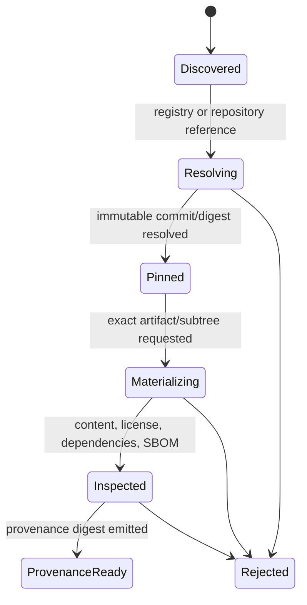
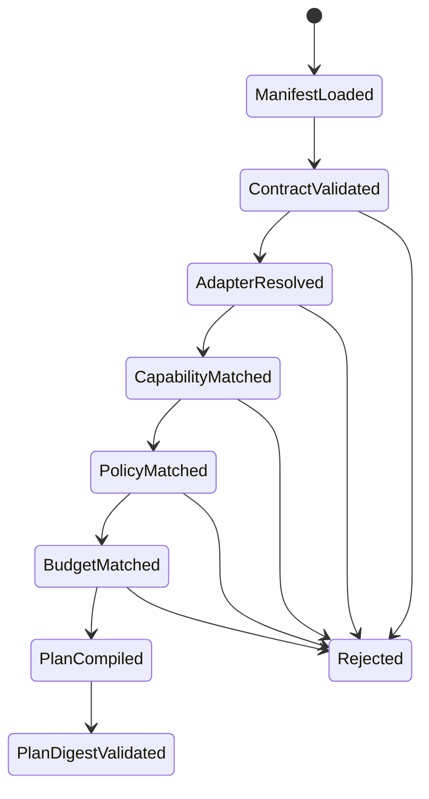
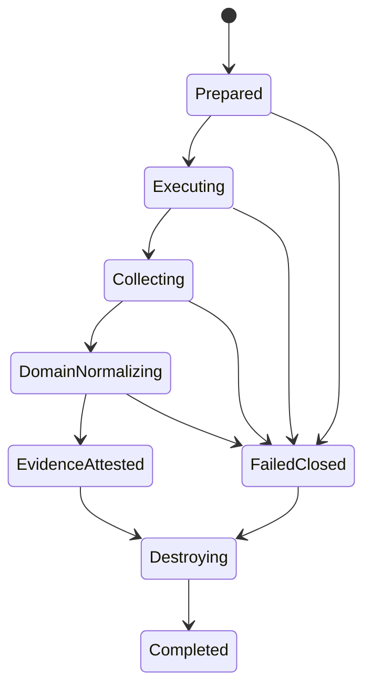
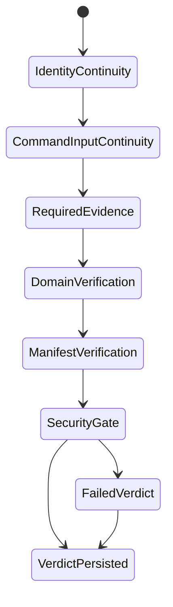
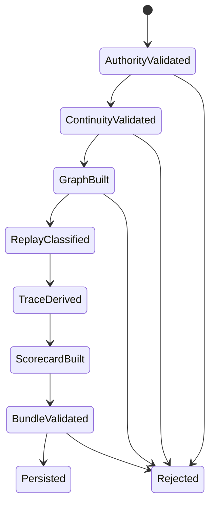
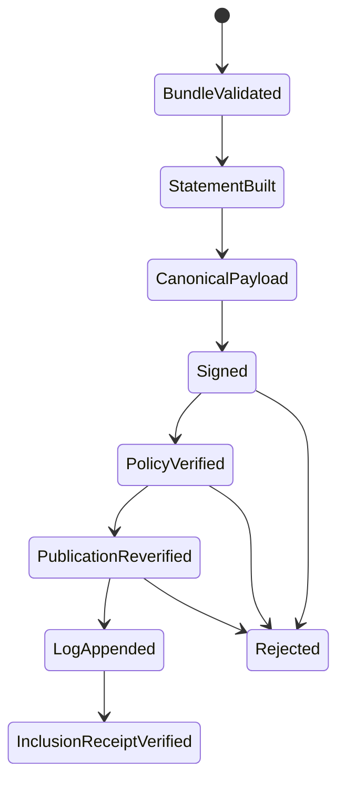
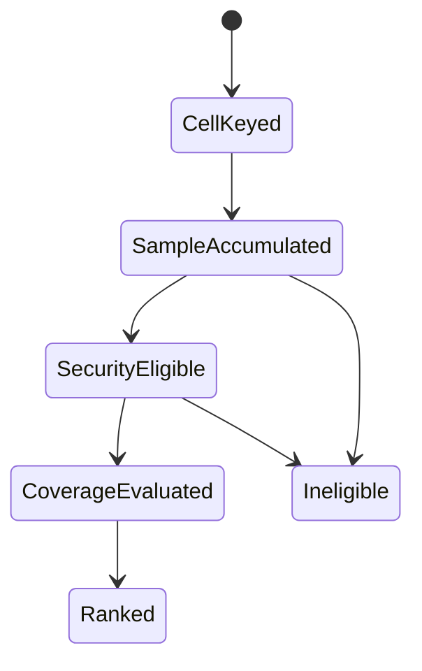
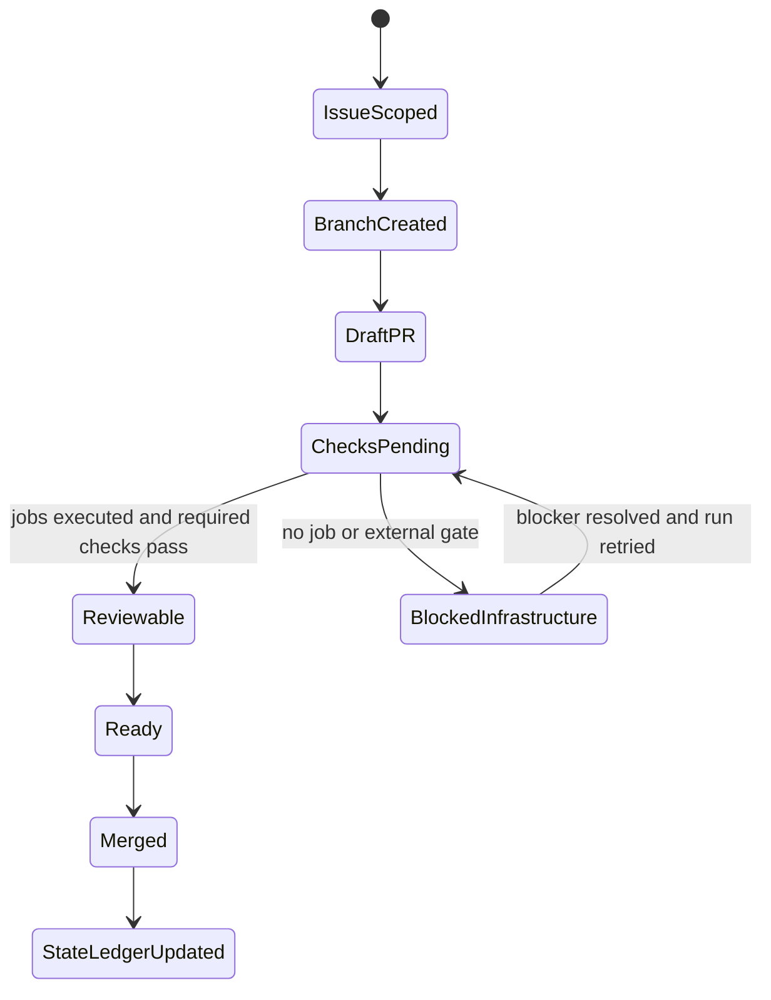

# Directory-Owned State Machines and Data Flow

This document defines which repository areas own each state transition. It prevents new domains from duplicating orchestration, weakening trust boundaries, or placing evidence logic in the wrong layer.

The compact map is duplicated in [`README.md`](../README.md). This file is the detailed contract.

## Architectural rule

A directory or module may own a transition only when it owns the evidence required to justify that transition.

Examples:

- A Domain runner may report what it observed, but it does not own the global security verdict.
- A runtime adapter may attest that a collector ran, but it does not own evaluator authority.
- The attestation layer may prove which bytes were signed, but it cannot change task correctness.
- Documentation may describe a state, but it cannot establish the state.

## Repository topology and ownership

```text
Skill.md-native/
├── AGENTS.md
│   └── repository-wide policy, trust, evidence, and working invariants
├── README.md
│   └── entrypoint, current-state summary, topology, state-machine and PR index
├── docs/
│   ├── ARCHITECTURE.md
│   ├── EVALUATION_CONTRACT.md
│   ├── HARNESS_KERNEL.md
│   ├── CODING_AGENT_HARNESS.md
│   ├── RUN_ARTIFACTS.md
│   ├── ATTESTATIONS.md
│   ├── INTEGRATION_STATE.md
│   ├── STATE_MACHINES.md
│   └── STACKED_DELIVERY.md
├── src/skill_native/
│   ├── ingestion and provenance
│   ├── Harness Kernel contracts/compiler/verifiers
│   ├── domain contracts, trusted runners, and adapters
│   ├── runtime controllers and capability/evidence profiles
│   ├── governed inference broker
│   ├── evidence/security/scoring/reporting
│   ├── Run Artifact construction
│   └── attestation and transparency publication
├── cloudflare/
│   ├── worker/
│   └── dynamic-worker/
├── examples/
│   ├── harnesses/
│   ├── run-artifacts/
│   └── attestations/
├── schemas/
│   └── generated public contracts checked for drift
├── tests/
│   └── transition, continuity, failure-path, tamper, and compatibility regressions
└── .github/workflows/
    └── executed state gates and external integration entrypoints
```

## Directory responsibility matrix

| Directory or module group | State machine owned | Inputs | Outputs | Must not claim |
|---|---|---|---|---|
| `registries.py`, `github_ingest.py`, `provenance.py`, `supply_chain.py`, `run_factory.py` | ingestion/provenance | mutable registry/repository reference | immutable materialization, provenance digest, SBOM/license evidence, RunSpec linkage | runtime success or publisher trust from popularity |
| `models.py`, `harness_contract.py` | contract validation | manifest and RunSpec payloads | strict typed contracts | runtime support that is not in a capability profile |
| `harness_adapters.py`, domain adapter modules | domain compilation/normalization | validated manifest, RunSpec, raw runtime evidence | command/stdin plan, normalized domain evidence, domain checks | global security or ranking eligibility |
| `harness_kernel.py`, `harness_kernel_impl.py`, `harness_verifiers.py` | plan, execute, verify | manifest, RunSpec, RuntimeAdapter | HarnessPlan, EvidenceBundle, HarnessVerdict | live evidence when a fake runtime was used |
| `coding_contract.py`, `coding_agent.py` | Coding runner | task, pinned child command, workspace/test policy | CodingAgentReceipt, workspace diff, event/test evidence | trust in child natural-language claims |
| Browser modules on PR #29 | Browser runner | deterministic Browser action plan and origin policy | BrowserReceipt and content-addressed Browser artifacts | public/credentialed/isolated Browser verification without persisted evidence |
| Android modules planned by Issue #28 | Android runner | constrained ADB action plan and device constraints | Android receipt and device/UI artifacts | arbitrary shell or physical-device verification from a scripted fixture |
| `runtime.py`, `openshell.py`, `cloudflare_runtime.py`, `runtime_harness_controllers.py` | runtime lifecycle | RunSpec policy, command/stdin | lifecycle IDs, raw evidence, capability/evidence attestation | evaluator authority or successful assertions |
| `gateway.py`, `providers.py`, `provider_metadata.py`, `policy.py` | inference routing | broker request and operator policy | provider attempt receipts and budget state | quota bypass, secret ownership by the Skill, silent provider substitution |
| `evidence.py`, `security.py`, `adversarial.py`, `security_benchmark.py` | evidence/security | normalized EvidenceBundle | evidence IDs, findings, non-compensable security gate | task correctness from absence of a finding |
| `scoring.py`, `compatibility.py`, `reporting.py` | cross-run aggregation | verified runs and explicit confounder keys | compatibility cells, uncertainty, reports/ranking | universal compatibility from a single cell |
| `run_artifact_*.py`, `run_artifacts.py` | post-run trust graph | EvaluatorAuthority, plan, evidence, verdict | EvidenceGraph, ReplayManifest, LogicalTrace, OutcomeScorecard, RunArtifactBundle | signature identity, real timing, or exact replay without required evidence |
| `attestation_*.py`, `attestations.py`, `transparency_log.py` | signing/publication | valid RunArtifactBundle, key, verifier policy | DSSE envelope, verification receipt, log entry/checkpoint/inclusion receipt | correctness, runtime verification, public witnessing, or OIDC identity unless implemented |
| `schemas/` | contract publication | deterministic schema exporters | exact JSON Schema files | hand-edited semantic divergence from Python models |
| `tests/` | transition proof | fixtures and adversarial mutations | executable regression evidence | external runtime evidence unless a real service ran |
| `.github/workflows/` | delivery/verification gate | branch/PR/dispatch event | executed checks and persisted artifacts | success when no job started |
| `examples/` | executable documentation | pinned deterministic inputs | reproducible fixtures | production verification |
| `cloudflare/` | deployable remote runtime bridge | Worker bindings and policy | runtime API/evidence bridge | account-backed execution without a real deployment |

## State machine A — immutable ingestion



### Transition evidence

```text
Discovered → Resolving
  source URL/type exists

Resolving → Pinned
  immutable commit, package digest, or content hash exists

Pinned → Materializing
  exact immutable source is fetched

Materializing → Inspected
  entrypoint exists; extraction remained inside the requested subtree

Inspected → ProvenanceReady
  content digest and provenance record validate
```

Mutable references may be accepted only as input to resolution. They cannot remain the evaluated identity.

## State machine B — Harness compilation



The compiler fails closed on unknown adapters, wrong domains, mutable provenance, unsupported evidence, unavailable capabilities, weaker policies, missing stdin transport, or budget overruns.

The output is a self-validating `HarnessPlan`. A Domain action plan that must not appear in argv is carried through stdin and bound through `stdin_digest`.

## State machine C — runtime lifecycle



### Ownership split

```text
RuntimeAdapter
  prepare / execute / collect / destroy

DomainAdapter
  compile domain command/input
  validate domain receipt
  normalize domain evidence
  emit domain verification checks

HarnessKernel
  enforce continuity
  require evidence
  apply security gate
  construct verdict
```

Cleanup runs even after failures. A runtime must not disappear before the evidence or cleanup decision is recorded.

## State machine D — verdict construction



A High or Critical security finding is non-compensable:

```text
security_gate = fail
→ security-gate check fails
→ HarnessVerdict.status = fail
→ downstream rank eligibility remains false
```

## State machine E — Run Artifact derivation



The evaluator authority is outside the untrusted Skill package and is bound to the exact manifest digest. Rehashed nested artifacts still must preserve cross-artifact continuity.

Logical timing is `not-captured` until a real exporter supplies timing evidence. Exact replay requires a captured immutable snapshot and pinned runtime identity, not a capability declaration alone.

## State machine F — attestation and publication



Publication repeats bundle, signature, key-ID, and policy verification. It never accepts a caller-created success receipt as authority.

The local checkpoint is content-addressed but not independently witnessed. Full log plus checkpoint replacement remains outside the current local threat boundary.

## State machine G — compatibility and ranking



Minimum cell identity:

```text
Skill artifact digest
× Agent harness/version
× Runtime/version
× Model/provider
```

No aggregator may silently pool across these confounders. A single successful cell is exploratory, not universal verification.

## State machine H — GitHub delivery and evidence-state update



A merge and a verification-state upgrade are separate transitions. Merging implementation does not close account-backed runtime Issues unless the required evidence was persisted.

## End-to-end data flow and trust boundaries

```text
UNTRUSTED SOURCE
Registry / repository / Skill package
        │
        ▼
TRUSTED INGESTION CONTROL PLANE
immutable provenance + SBOM/license evidence
        │
        ▼
TRUSTED COMPILER
HarnessManifest + RunSpec + DomainAdapter
        │
        ▼
HarnessPlan ───────────────┐
        │                  │
        ▼                  │
UNTRUSTED EXECUTION TARGET │
Skill / child agent / page / device
        │                  │
        ▼                  │
TRUSTED RUNTIME + DOMAIN COLLECTORS
raw evidence → validated domain receipt
        │
        ▼
EvidenceBundle ◄───────────┘
        │
        ▼
TRUSTED VERIFIERS
continuity + required evidence + domain checks + security gate
        │
        ▼
HarnessVerdict
        │
        ▼
VERIFIER-OWNED AUTHORITY
EvidenceGraph + ReplayManifest + LogicalTrace + OutcomeScorecard
        │
        ▼
RunArtifactBundle
        │
        ▼
SIGNING / PUBLICATION CONTROL PLANE
DSSE signature + policy verification + transparency inclusion
        │
        ▼
CROSS-RUN ANALYTICS
compatibility cells + uncertainty + reports/ranking
```

## Extension checklist for a new domain

A new domain PR stack must identify these owners explicitly:

```text
[ ] strict domain contract
[ ] action grammar with no arbitrary command escape hatch
[ ] trusted runner that owns stdout
[ ] self-validating receipt
[ ] runtime transport requirements
[ ] content-addressed large artifacts
[ ] EvidenceBundle channels and collector attestation
[ ] DomainAdapter normalization and checks
[ ] Evidence Graph integration
[ ] failure-path and tamper tests
[ ] schema export and drift check
[ ] deterministic fixture evidence level
[ ] external/runtime evidence level and non-claims
[ ] README, Integration State, and Stack ledger updates
```

If any owner is ambiguous, stop and resolve the architecture before adding another abstraction.